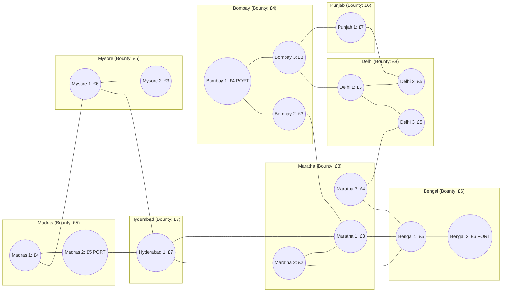

# Regions

## Adjacency matrix
|             | Madras 1 | Madras 2 | Mysore 1 | Mysore 2 | Hiderabad 1 | Bombay 1 | Bombay 2 | Bombay 3 | Maratha 1 | Maratha 2 | Maratha 3 | Punjab 1 | Delhi 1 | Delji 2 | Delhi 3 | Bengal 1 | Bengal 2 |
|-------------|----------|----------|----------|----------|-------------|----------|----------|----------|-----------|-----------|-----------|----------|---------|---------|---------|----------|----------|
| Madras 1    |          | x        | x        |          |             |          |          |          |           |           |           |          |         |         |         |          |          |
| Madras 2    | x        |          |          |          | x           |          |          |          |           |           |           |          |         |         |         |          |          |
| Mysore 1    | x        |          |          | x        | x           |          |          |          |           |           |           |          |         |         |         |          |          |
| Mysore 2    |          |          | x        |          |             | x        |          |          |           |           |           |          |         |         |         |          |          |
| Hiderabad 1 |          | x        | x        |          |             |          |          |          |           | x         |           |          |         |         |         |          |          |
| Bombay 1    |          |          |          | x        |             |          | x        | x        |           |           |           |          |         |         |         |          |          |
| Bombay 2    |          |          |          |          |             | x        |          |          | x         |           |           |          |         |         |         |          |          |
| Bombay 3    |          |          |          |          |             | x        |          |          |           |           |           | x        | x       |         |         |          |          |
| Maratha 1   |          |          |          |          | x           |          |          |          |           | x         |           |          |         |         |         | x        |          |
| Maratha 2   |          |          |          |          | x           |          |          |          | x         |           |           |          |         |         |         | x        |          |
| Maratha 3   |          |          |          |          |             |          |          |          |           |           |           |          |         |         | x       | x        |          |
| Punjab 1    |          |          |          |          |             |          |          | x        |           |           |           |          |         | x       |         |          |          |
| Delhi 1     |          |          |          |          |             |          |          | x        |           |           |           |          |         | x       | x       |          |          |
| Delhi 2     |          |          |          |          |             |          |          |          |           |           |           | x        | x       |         |         |          |          |
| Delhi 3     |          |          |          |          |             |          |          |          |           |           | x         |          | x       |         |         |          |          |
| Bengal 1    |          |          |          |          |             |          |          |          |           | x         | x         |          |         |         |         |          | x        |
| Bengal 2    |          |          |          |          |             |          |          |          |           |           |           |          |         |         |         | x        |          |

## Income by region
| Region | Income | Comment | 
|--------|--------|--------|
| Madras 1 | £4 | |
| Madras 2 | £5 | Port |
| Mysore 1 | £6 | |
| Mysore 2 | £3 | |
| Hyderabad 1 | £7 | |
| Bombay 1 | £4 | Port |
| Bombay 2 | £3 | |
| Bombay 3 | £3 | |
| Maratha 1 | £3 | |
| Maratha 2 | £2 | |
| Maratha 3 | £4 | |
| Punjab 1 | £7 | |
| Delhi 1 | £3 | |
| Delhi 2 | £5 | |
| Delhi 3 | £5 | |
| Bengal 1 | £5 | |
| Bengal 2 | £6 | Port |

**Port** - This node is an entry point for correspondend presidency trade and military

## Military bounty for region
| Region | Bounty | Comment | 
|--------|--------|--------|
| Madras | £5 | |
| Mysore |  £5 | |
| Hyderabad | £7 | |
| Bombay | £4 | |
| Maratha | £3 | |
| Punjab | £6 | |
| Delhi | £8 | |
| Bengal | £6 | |

