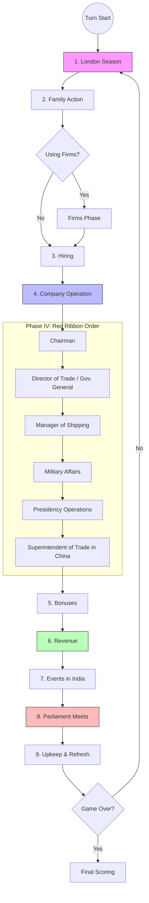

# John Company: Rules Outline
*(Detailed Phase Steps)*

---
## Key Concepts & Glossary
- **Company Balance vs. Office Treasuries**: The *Company Balance* is managed by the Chairman to take on Debt and pay Dividends. *Office Treasuries* belong to specific offices (e.g., Director of Trade, Managers, Presidents) and must be spent on their respective operations and success checks.
- **Fatigue**: Placed on office cards. Each fatigue adds +1 to Attrition rolls during the London Season, increasing the risk of forced retirement.
- **Unrest**: Placed in regions. Each unrest cube increases the strength of any attacks against the Company in that region, and triggers simultaneous rebellions.
- **Standing**: Represents public confidence in the Company. If Standing ever drops to zero (the far-left space), the game ends immediately with Company Failure.

## Success Checks
Almost all Company Operations and Presidential events require a dice roll based on the resources spent. Rolling more dice guarantees better chances.

| Dice Rolled | Success (1-2) | Failure (3-4) | Catastrophic Failure (5-6) |
|-------------|---------------|---------------|----------------------------|
| 1d6         | 33%           | 33%           | 33%                        |
| 2d6         | 56%           | 33%           | 11%                        |
| 3d6         | 70%           | 26%           | 4%                         |
| 4d6         | 80%           | 19%           | 1%                         |
| 5d6         | 87%           | 13%           | <1%                        |
| 6d6         | 91%           | 9%            | <1%                        |
| 7d6         | 94%           | 6%            | <1%                        |

*A catastrophic failure immediately removes the officeholder, vacates the office, and cancels the rest of the action.*

## Phase Summaries (Detailed Sequence of Play)

### I. The London Season
*(Skipped on the first turn)*
1. **Attrition**: All players simultaneously roll 1d6 for each office card they hold (+1 to the roll for each fatigue on the card, +1 for Chairman). 
   - *1-2*: Safe. 
   - *3-4*: Add a fatigue. 
   - *5+*: Officeholder retires. Move family member to Pensioners box, flip office card to vacant stack, clear fatigue.
2. **Retirements**: Starting with the Chairman and going clockwise, players may retire pensioners into prize boxes by paying the printed cost. This secures victory points.
3. **Prestige Cards**: In order of most money spent on retirements this turn (ties broken by most total window icons, then Prime Minister order), players optionally draw one card from the London Season Display. Then, the display is refilled to 3 cards.

### II. Family
1. **Family Action**: Starting with the Chairman and proceeding clockwise, each player takes one action (or two if they repeat the action marked by their opportunity marker):
   - *Enlist Writer*: Place family member in a Writer box.
   - *Enlist Officer*: Place family member in Officers-in-Training.
   - *Purchase Luxury*: Pay £4, take a luxury enterprise (0 VP immediately, but counts for power. Includes a window tax icon).
   - *Purchase Shipyard*: Pay £2, take shipyard, place unfitted ship on it.
   - *Purchase Workshop*: Pay £5, take workshop (£1 bonus/turn, 2 votes).
   - *Seek Share*: Place family member on Stock Exchange track by paying printed cost.
2. **New Company Shares**: 
   - If Company has Debt, move the rightmost family member on the Stock Exchange to the Court box (becomes a share) to lower Company Debt by one. Repeat until no Debt or track is empty.
   - Slide any remaining members on the Stock Exchange to the right.

### III. Hiring
- Vacant offices are hired in ascending numerical order, following the candidate pool listed on the back of each office card.
- **Nepotism**: Choosing your own family member requires verbal consent from all other players who had eligible candidates in the pool.
- *Chairman Election*: Elected by a majority of shares in the Court.

### IV. Company Operation
Offices act based on the red ribbon from left to right:
1. **Chairman**: May increase Company Debt (each advance adds £5 Balance; more than 3 advances requires majority Court approval). Must then allocate Company Balance to other office treasuries.
2. **Director of Trade**: May try "Special Envoy" checks to open an order or open Trade with China. Then, may make up to two transfers of writers/ships. *(If the Governor General is in play, they act here to Govern and Tax/Build).*
3. **Manager of Shipping**: Uses treasury (until £2 remains) to fit ships from shipyards (£3), buy Company ships (£5), or lease Extra ships (£2).
4. **Military Affairs**: Up to two Army transfers. Assigns Officers-in-Training to Armies. Appoints/Replaces Army Commanders based on who has the most pieces in each Army.
5. **Presidency Operations**: (Bombay, Madras, Bengal). 
   - *Trade*: President rolls dice based on spent treasury to fill open orders in India depending on fleet size, earning bonuses.
   - *Commanders*: Can purchase local alliances, then "Deploy" (make checks to attack regions, earning loot and trophies). Success can establish new Company Governorships.
   - *Governors*: "Administer" (make checks based on a diminishing dice pool) to tax, build company ships, or commission regiments. Failures cause unrest.
6. **Superintendent of Trade in China**: (If in play) Checks to trade in China to earn £4 per opium icon for the Company and £1 for the player.

### V. Bonuses
- Every player collects £1 for each shipyard they own with a fitted ship, and £1 for each workshop they own.

### VI. Revenue
1. **Expenses**: Lower Company Balance by £1 for each debt, regiment, officer, and ship in sea zones. *(If Balance is insufficient, take emergency loans, which negatively harms Standing).*
2. **Check Expectations**: Lower Standing by one if the remaining Balance is less than Expectations.
3. **Pay Dividends**: Chairman may individually pay dividends out of the remaining Company Balance (£1 per share). Triggers Public Enthusiasm if dividends exceed Expectations.

### VII. Events in India
1. **Storm Die**: Roll the storm die to damage or sink ships in affected sea zones.
2. **Resolve Events (India tiles)**: Flip India event tiles based on the storm die number. These trigger Turmoil, Windfalls, Shuffles, Leaders, Peace, Crises (Invasions, Rebellions), or Foreign Invasions which restructure the political map and close orders.
3. **Company Attacks**: If Company regions are attacked and lost, local authority is restored and the Company loses Standing (can trigger immediate game-over).

### VIII. Parliament Meets
1. **Select Law & Policy**: Prime Minister draws up to 3 law cards, chooses one (unless a dilemma is drawn early). The PM must also select a Policy consequence (Tax, Bonus, Power).
2. **Voting**: Players spend money (£1 = 1 vote) or exhaust enterprises/cards to cast votes for or against. Changing votes against the law puts a player in the "Opposition."
3. **Resolution**: If passed (0+ support), the law takes effect, Policy is executed, and PM keeps a passed law token. If failed (< 0 support), the law is discarded, the Opposition Leader becomes the new PM, and the new PM resolves a shifted Policy consequence instead.

### IX. Upkeep and Refresh
1. **Upkeep**: Everyone pays the maintenance costs for their family members on prize boxes. (Failure means removing the piece and losing VPs).
2. **Cleanup**: Return writers, filled order tokens, Presidency dividers, and extra ships to their supplies. Un-exhaust all officers and regiments.
3. Advance the chronological turn marker.

---

## Appendix: Resolving Events in India

Events significantly restructure the political landscape of India and represent the push and pull of local factions and Company forces.

### Detailed Resolution Steps

1. **Turmoil**: Close the northernmost open order in the region. If all orders in the region are already closed, trigger a **Cascade** (close all open orders directly connected to the region's orders).
2. **Peace**: Open any orders connected through the border the Elephant currently stands on. Add one tower level to each region touching the Elephant (excluding Company-controlled regions). Then perform the **Elephant's March** to relocate the Elephant.
3. **Crisis**: The current position of the Elephant determines the scope of the conflict. The Elephant's tail represents the attacking region, and the head represents the defending region.
   - **Invasion**: (If attacker is Sovereign). The attacker's strength (plus empire regions and event modifier) is compared to the defender's strength. Successful invasions exchange flags, potentially shattering or forming new empires. Failed invasions cost the attacker 1 tower level.
   - **Rebellion**: (If attacker is Dominated). Attacks only its sovereign. Successful rebellions force the attacker to become sovereign, close all open orders in the region, and trigger a Cascade. Failed rebellions cost the sovereign 1 tower level.
   - **Attack Against the Company**: If a Company region is targeted, the primary Crisis is resolved first. In addition, an extra Rebellion Crisis occurs in *each* other region that has unrest cubes. Commanders must exhaust officers, regiments, and alliances to match the crisis strength. If the defense fails, the Company loses the region, losing Standing and triggering Region Loss cleanup.
4. **Foreign Invasion**: Based on the storm die, resolve an Invasion Crisis in a specific sea zone's regions. If the invasion is successful, all open orders are closed (triggering Cascades), flags/domes are removed, and the region's base strength is cut in half.

---

## Appendix: Negotiations & Promises
*John Company* is heavily focused on negotiation. Players can transfer assets to form coalitions, secure votes, or get favorable outcomes in hiring and operations.
- **What CAN be traded**: Cash from family treasuries, Promise cards, Enterprises (Shipyards, Workshops, Luxuries), Company Shares, and **facedown** Blackmail cards.
- **What CANNOT be traded**: Passed Laws, Spouses, Trophies, active Officeholders, pieces on prizes, and the Prime Minister dial.
- **Binding vs. Non-Binding**: Any deal involving the immediate transfer of pieces or cash is binding. Promises of future action are non-binding (unless guaranteed securely by a Promise card).

## Appendix: Deregulation & Private Firms
If playing an 1813 scenario or if the Deregulation law passes early, the monopoly opens to private trading firms.
- **Firm Treasuries**: Firms separate cash into the *London Treasury* (for expenses and fitting ships) and the *India Treasury* (holds revenue generated from trading in India, which pays dividends before filtering to London).
- **Special Retirements**: Shareholders of firms that have paid dividends may take an extra retirement directly from their family supply during the London Season without using a pensioner, up to the value of the highest dividend paid.

## Appendix: Final Scoring & Game End
The game ends either after the final turn or immediately if the Company's Standing fails. Ties are broken by the most window tax icons, then by PM order. Scoring happens in 3 steps:
1. **Power Award**: Players calculate total Power from Enterprises, passed Laws, Trophies, Spouses, Blackmail cards, and the Prime Minister dial. The players with the 1st and 2nd most power gain VPs based on the scoring track based on the final turn number.
2. **Score Court and Workshops**:
   - *If the Company Survived*: Each Court Share is worth positive VPs depending on the Court value.
   - *If the Company Failed*: Each Court Share loses you that many VPs instead.
   - Every owned Workshop is worth +1 VP regardless.
3. **Closing Consequence**:
   - *If the Company Survived*: All players roll Attrition and perform one final retirement into prize boxes.
   - *If the Company Failed*: Draw and resolve a Company Failure card, which usually assigns blame and severe VP penalties to specific players.